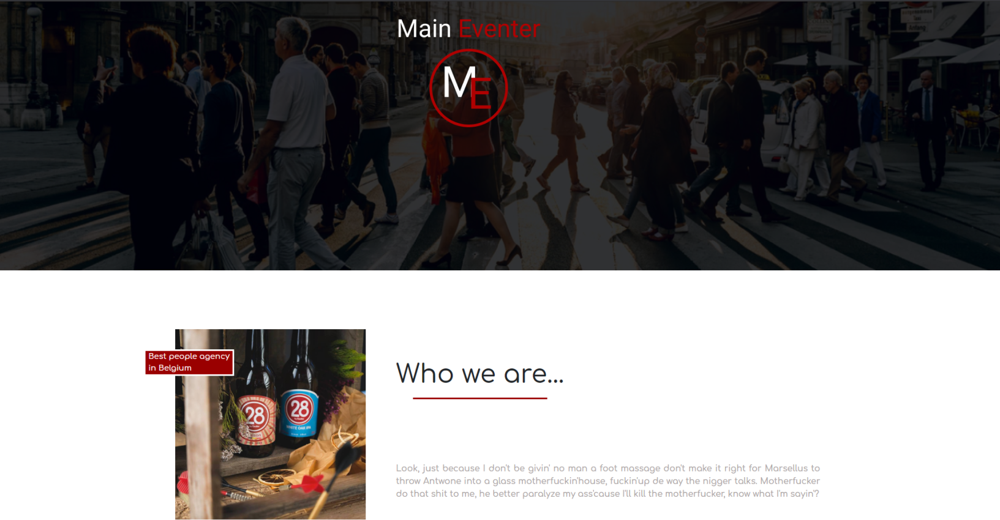

# Main Eventer
* Team project with

    * [Joelle Everaert](https://github.com/Joelle-Everaert)
    *   [Simon Doneux](https://github.com/doneuxsimon)
    *   [Cemil Ylmaz](https://github.com/Cemil1000)
    *   [Abdelilah Zaidi](https://github.com/abdelilahzaidi)

* 05.11.2020

## What is this ?
It is a group work as part of our training at **[BeCode](https://becode.org)**.  
We worked by branch and then gathered the common work. 
We divided the work into separate parts.

## Context  
We received a request from a client to create a website.
He gave us a draft of what he would like.
So we put it in shape.

## Purpose?
Putting our knowledge and cohesion into practice through teamwork.

## Languages used?
* HTML
* CSS
    * Flexbox
    

## Overview 
 

### Original instruction

[Link](https://github.com/becodeorg/bxl-hopper-1-25/tree/master/The%20Field/3.HTML%2BCSS/4.main_eventer)

